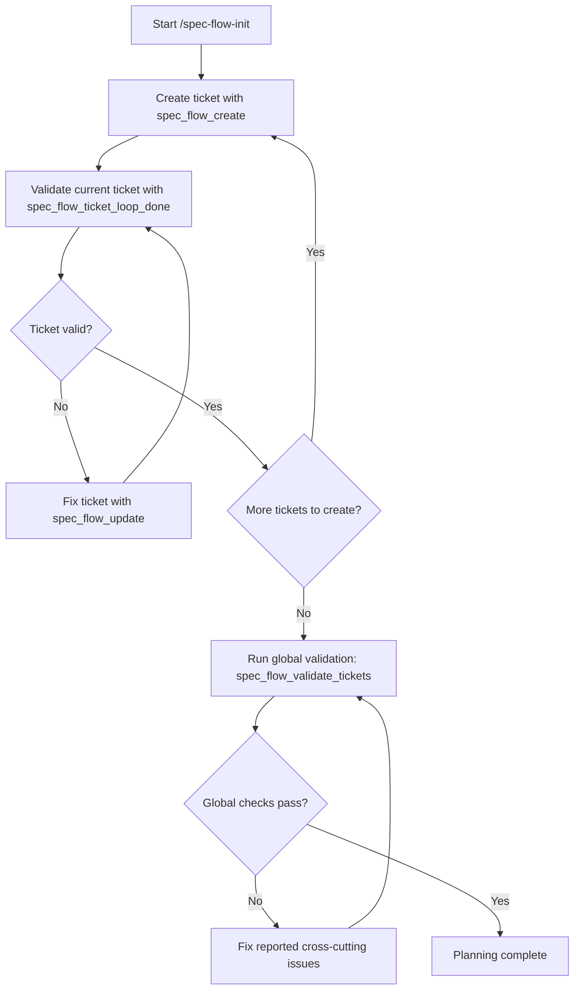

# pi-spec-flow

Pi extension that turns a technical spec into structured implementation tickets stored as Markdown files.

## Install

```bash
pi install pi-spec-flow@latest
```

Pi will auto-discover the extension via `pi.extensions` in `package.json`.

## Quick start

```text
1. /spec-flow-init my-spec.md      ← Planning (generates tickets)
2. /spec-flow-implement             ← Implementation (opens ticket sessions)
```

## Workflow

### 1) Planning

```text
/spec-flow-init <spec.md>
```

The extension reads the spec and guides the LLM to create structured, validated tickets following a planning methodology. Tickets are created one by one with a validation loop that ensures each one has acceptance criteria, verification steps, estimated scope, and phase.

If tickets already exist for that feature key, you'll be prompted to replace them.

### 2) Implementation

```text
/spec-flow-implement          (or /spec-flow-start)
```

Opens a new isolated session scoped to one ticket. When the ticket is completed, the next one is automatically queued.

**Per-ticket flow:**

```text
1. Start:        spec_flow_update(id: X, status: "in_progress")
2. Implement:    code within the ticket scope only
3. Handoff:      spec_flow_update(id: X, handoff_summary: "...", handoff_files: "...", handoff_decisions: "...", handoff_verification: "...", handoff_risks: "None", handoff_next_ticket: "...")
4. Close:        spec_flow_handoff_loop_done(ticket_id: X, feature_key: "checkout")
```

If the handoff fields are incomplete, a fix loop starts and you're prompted to complete them before the ticket is marked done.

### Feature selection

When multiple features have pending tickets, `/spec-flow-implement` asks you to choose. You can also pass the feature explicitly:

```text
/spec-flow-implement --feature=checkout
/spec-flow-next --new --feature=checkout
```

If only one feature has unfinished tickets, it's selected automatically.

## Commands reference

| Command | Description |
|---------|-------------|
| `/spec-flow-init <spec.md>` | Generate validated tickets from a spec |
| `/spec-flow-implement` | Start implementation (opens ticket sessions) |
| `/spec-flow-start` | Alias for `/spec-flow-implement` |
| `/spec-flow-next` | Show next pending ticket (or open it with `--new`) |

## Tools reference

The extension also exposes these tools for programmatic access:

| Tool | Description |
|------|-------------|
| `spec_flow_create` | Create a new ticket |
| `spec_flow_update` | Update ticket fields or status |
| `spec_flow_validate_tickets` | Validate all tickets for completeness |
| `spec_flow_ticket_loop_done` | Validate a single ticket (planning loop) |
| `spec_flow_handoff_loop_done` | Validate handoff before closing a ticket |

## Ticket storage

Tickets are stored as Markdown files in:

```text
{ticketsFolder}/{feature-name}/*.md
```

Default: `./docs/features` (configurable in `spec-flow.config.json`). Tickets should use `feature_key` for the logical feature name/folder and `source_spec_path` for the real spec document path, for example `docs/implementation-spec.md`.

## Flow diagram



---

## For developers

### Local development

```bash
npm install
```

Pi loads the extension from `package.json`:

```json
{
  "pi": {
    "extensions": ["./src/index.ts"]
  }
}
```

### Publish to npm

```bash
npm version patch   # or minor, or major
npm pack --dry-run  # preview included files
npm publish
git push --follow-tags
```

Files included in the published package: `src/`, `skills/planning-methodology/`, `README.md`, `LICENSE`.
