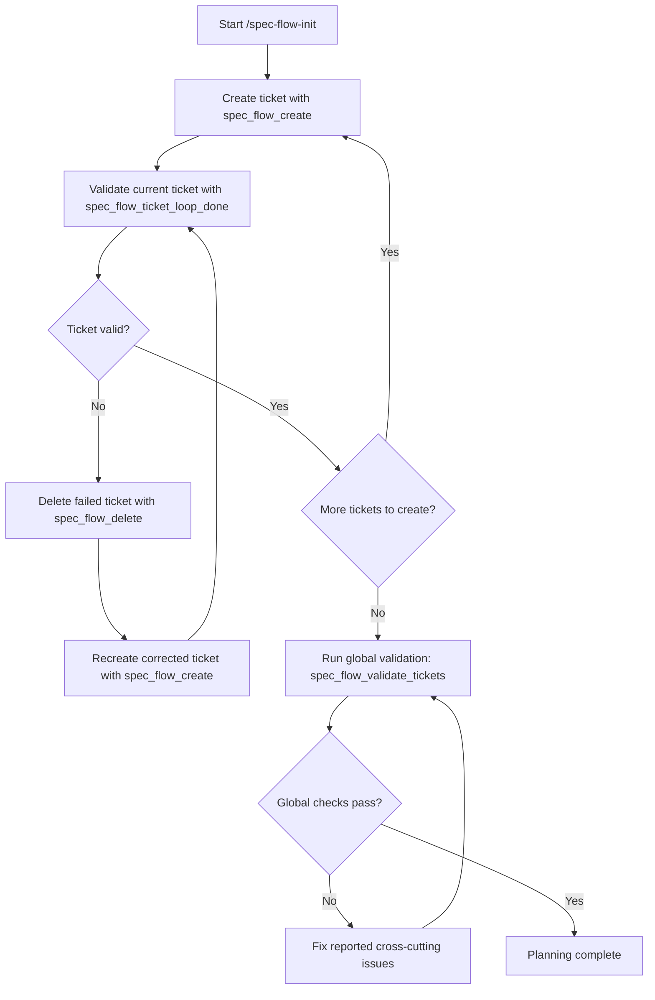

# pi-spec-flow

Pi extension that turns a technical spec into structured implementation tickets stored as Markdown files.

## Install (local dev)

```bash
npm install
```

Pi loads extension from `package.json`:

```json
{
  "pi": {
    "extensions": ["./src/index.ts"]
  }
}
```

## Features

- `/spec-flow-init <spec.md>`: parse spec and trigger ticket planning
- `/spec-flow-list`: list tickets by phase and status
- `/spec-flow-next`: show next pending ticket
- LLM tools:
  - `spec_flow_create`
  - `spec_flow_query`
  - `spec_flow_update`

## Planning

Ticket planning is enforced by the extension as a guided state machine (not left to LLM discretion).

### Per-ticket loop

1. Create one ticket (`spec_flow_create`)
2. Validate that exact ticket (`spec_flow_ticket_loop_done`)
3. If validation fails:
   - delete failed ticket (`spec_flow_delete`)
   - recreate corrected ticket (`spec_flow_create`)
   - validate again (`spec_flow_ticket_loop_done`)
4. If validation passes, move to the next ticket and repeat
5. After all tickets pass individually, run global validation (`spec_flow_validate_tickets`) for cross-cutting checks (dependencies/checkpoints)

### Flow diagram



## Ticket storage

- Config file: `spec-flow.config.json`
- Config key: `ticketsFolder`
- Default: `./docs/features`
- Structure:
  - `{ticketsFolder}/{feature-name}/*.md`

## Internal resources

### Runtime (published)
- `skills/planning-methodology/SKILL.md`

Registered through `resources_discover` in `src/events.ts`.


## Publish to npm

### Prerequisites

```bash
npm login
```

### Steps

```bash
# 1. Bump version
npm version patch   # or minor, or major

# 2. Dry run (check what gets included)
npm pack --dry-run

# 3. Publish
npm publish

# 4. Tag release (if using git)
git push --follow-tags
```

### Files included in package

Only `src/`, `skills/planning-methodology/`, `README.md`, and `LICENSE`.  
Dev/meta files (`AGENTS.md`, `.agents/`, `spec-flow.config.json`, `spec.md`) stay out of the published tarball.

### Consumer installation

```bash
pi install pi-spec-flow@latest
# or
npm install pi-spec-flow
```

Pi will auto-discover the extension via `pi.extensions` in `package.json`.
